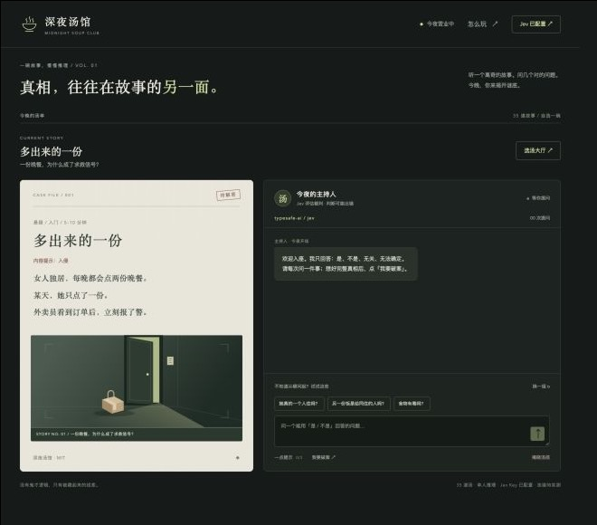
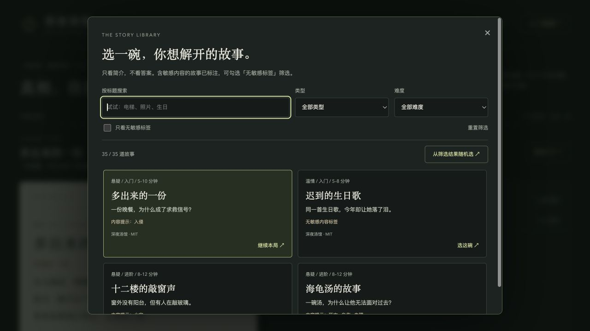

# 深夜汤馆 · Midnight Soup

**一碗故事，慢慢推理。** 一个由 Jev 担任裁判的单人海龟汤 Web 游戏。

从离奇的「汤面」出发，通过是非问题找出隐藏的因果关系，再提交完整推理。页面采用墨绿与暖纸色的档案风格，支持桌面和手机。





## 能玩什么

- 35 道固定故事：原有 3 道 + TurtleBench 改编题库 32 道，覆盖日常、温情、悬疑和奇幻。
- 「选汤大厅」支持标题搜索、类型/难度组合筛选、无敏感标签筛选和从结果中随机选题。
- 列表仅展示标题、标签、简介与来源，不显示汤底；中途换题会确认是否重新开局。
- 自由提问与推荐问题统一由 Jev 判断：**是 / 不是 / 无关 / 无法确定**。
- 每局三个递进提示；可以提交完整推理破案，或主动揭晓汤底。
- 聊天记录区固定高度、内部滚动，加载状态不会新增一行撑高面板。
- 刷新页面可继续当前一局；没有登录系统或数据库。

**没有模拟回复或练习模式。** 未配置 API Key 时可查看题目，但不能调用模型提问或判断推理。

## 快速开始

需要 **Node.js 22.9+**、npm，以及有权访问 Jev 的 **Vercel AI Gateway API Key**。

```sh
git clone https://github.com/YJGGZHK/midnight-soup.git
cd midnight-soup
npm ci
cp .env.example .env
```

在 `.env` 中填入：

```dotenv
AI_GATEWAY_API_KEY=你的Vercel_AI_Gateway_Key
```

启动：

```sh
npm start
```

本机打开 `http://127.0.0.1:8787`。Key 只由服务端读取，不发送到浏览器；修改 Key 后，在页面「连接 Jev」中刷新连接状态即可，无需重启。

> 「已配置」仅表示读取到了 Key，不代表模型鉴权或调用已成功。模型当前可用性、免费活动和计费以 Vercel 为准，本项目不承诺永久免费。

## 局域网访问

默认监听 `0.0.0.0:8787`，启动日志会打印本机地址，以及**带访问码的完整局域网地址**：

```text
http://<本机局域网IP>:8787/?access=<访问码>
```

首次需通过完整链接进入。服务端设置访问 Cookie 后，地址会自动跳转到 `/`，这是正常现象。换浏览器、无痕窗口或清除 Cookie 后，需要重新打开完整链接。

- 直接打开裸 IP 而没有访问 Cookie，会收到「请使用带访问码的完整链接打开」。
- 访问码不是模型 Key，但持有完整链接的人可使用你的模型额度，**不要公开分享**。
- 电脑和服务需保持运行；跨设备访问受防火墙、Wi-Fi 隔离等网络设置影响。
- HTTP 地址出现「不安全」提示表示连接未加密。本项目面向本机及可信局域网，**不要直接暴露公网**。

## 配置

| 变量 | 默认值 | 用途 |
| --- | --- | --- |
| `AI_GATEWAY_API_KEY` | 空 | 模型 Key，每次请求读取，无需重启 |
| `HOST` | `0.0.0.0` | 监听地址；仅本机使用可设为 `127.0.0.1` |
| `PORT` | `8787` | HTTP 端口 |
| `ACCESS_TOKEN` | 启动时随机生成 | 局域网访问码；可指定一个足够长的随机字符串 |

`HOST`、`PORT` 和 `ACCESS_TOKEN` 修改后需要重启服务。真实 `.env` 被 Git 忽略，只提交不含凭证的 `.env.example`。

## 实现方式

无需前端构建工具：原生 HTML/CSS/JavaScript + Node.js HTTP 服务。

- **模型**：`typesafe-ai/jev`。
- **接口**：AI SDK 的 `experimental_evaluate`，不是聊天接口。
- **提问**：将固定真相与玩家问题交给模型，通过 `choice` 返回四类判断。
- **破案**：通过 `boolean` 分别评估三个关键事实，全部达到阈值时揭晓汤底。
- **内容**：故事、提示和插画固定，不使用模型生成新汤底。
- **保密**：普通接口不返回隐藏汤底；主动揭晓或成功破案后才返回。源码公开，阅读 `data/` 中的题库文件会剧透。

```text
public/          页面、样式、交互及内嵌 SVG 插画
server.mjs       HTTP 服务、内存会话、访问校验
game.mjs        加载题库、评估请求和结果处理
data/           服务端题库及来源声明
licenses/       外部题库许可证原文
test.mjs        Node 内置测试
.env.example     无凭证的配置模板
docs/            界面截图
```

## 开发与检查

```sh
npm run check
npm test
```

测试覆盖：35 道题的结构、选题搜索/筛选/随机、题库直读拒绝、缺少 Key、推荐问题与自由提问调用模型、提示上限、汤底保密、会话恢复、输入校验、模型失败处理、概率阈值、跨站拒绝和局域网访问码。

测试使用模型替身，**不会产生真实模型请求，也不代表真实 Jev 连接或中文判断质量已验证**。

## 已知限制

- 模型可能误判；概率阈值是未校准的游戏规则，不代表实际准确率。
- 每次问题独立评估，不将聊天历史传给模型；请使用完整表述，避免「那个人」「刚才那个」等含糊指代。
- 会话存于服务进程内存，服务重启后丢失；不包含多用户账号、持久化、自动清理或全局调用限流。
- 每局最多 60 次提问与推理提交。不要把每局上限当成费用控制，请自行设置网关预算。
- 玩家问题和固定汤底会发送至 Vercel AI Gateway；不要输入真实敏感信息。
- 仅提供简单的本机/局域网访问保护，不是生产级公网部署方案；自定义域名、HTTPS 反向代理需另外适配。
- Jev 评估接口仍是实验性 API；依赖版本锁定在 `package-lock.json`，升级后需重新验证。

## 题库来源与许可

- 项目代码、自带三道故事和 SVG 插画采用 [MIT](LICENSE)。
- `data/turtlebench.json` 来自 TurtleBench 中文 staging 题库，采用 [Apache-2.0](licenses/TurtleBench-LICENSE)，不是项目原创，不统一改为 MIT。
- 固定来源版本、原版权声明及逐题修改说明见 [data/NOTICE.md](data/NOTICE.md)。部分现实人物相关叙述已虚构化，部分污名性用语做了中性改写。
- 每个导入题目已补充提示、关键事实和标签。2026-09-22 已用真实 Jev 验证《十八楼》的单次提问与完整破案（3/3）；未做全题库真实模型评测，仍可能存在误判或原故事的逻辑局限。
- 第三方依赖保留各自许可证。项目不附带模型授权、API Key 或服务额度。

## Android 安装包

`mobile/` 是不依赖作者服务器的 Android 壳：题库、进度与判题逻辑在本地，用户在 App 设置里填写自己的 Vercel AI Gateway Key，Key 保存在 Android Keystore。构建：

```bash
cd mobile
npm install
npm run apk
```

测试包输出在 `mobile/android/app/build/outputs/apk/release/app-release.apk`。联网判题仍需要网络，费用与额度由用户自己的 Vercel 账户承担。
